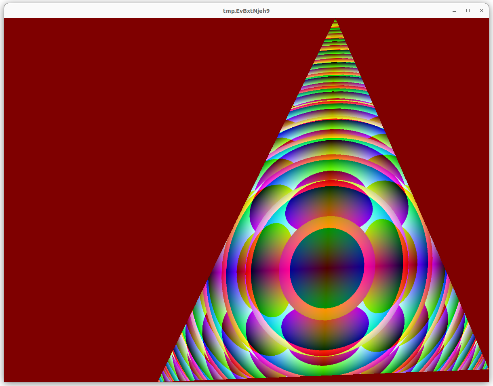
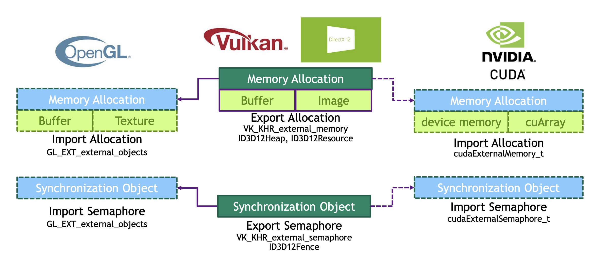

# OpenGL Interop


By Maximilian Müller

This blog is an introduction to fast OpenGL and CUDA interop. The goal is to explain how to mix CUDA as compute backend and 
OpenGL for displaying in the same application. In a nutshell, to achieve this, all objects are allocated in Vulkan, 
but rendered with OpenGL.
A sample how to do this with Vulkan only using a compute shader is shown [here](https://github.com/nvpro-samples/gl_vk_simple_interop).

Topics covered:
- Importing Vulkan memory to GL and CUDA
- Interoperability OGL <==> CUDA using VK semaphores



# Interop Paradigm

For OpenGL to work with CUDA, it is important that all memory objects (buffers and semaphores) are allocated in Vulkan. 
A handle of those objects needs to be retrieved which is used to import those elements to CUDA and GL. Those new 
OpenGL and CUDA objects are pointing to the exact same memory location as the Vulkan one, meaning that changes through 
either API are visible on all sides.

In the current example, we will deal with two memory objects:

- Vertices: holding the triangle objects
- Image: the pixels of the image

Another important aspect is the synchronization between OpenGL, CUDA and Vulkan. This topic will be discussed in detail
in the section Semaphores.




# Prerequisite

To compile the project please clone the [nvpro_core](https://github.com/nvpro-samples/nvpro_core) repository into the same parent folder as this repository, 
or provide the path to the parent directory of the nvpro_core repository via the cmake variable `BASE_DIRECTORY`.
Please note that it is needed to clone the repository recursively.
Furthermore, you need to have the Vulkan SDK and [CUDA toolkit](https://developer.nvidia.com/cuda-downloads) installed.
It was tested with the following CUDA versions: 11.7 and 11.8.
Please note that a cmake version higher than 3.12 is required.

## Vulkan Instance and Device 

A Vulkan Instance and a Device must be created to be able to create and allocate memory buffers on a physical device. 

In the example (main.cpp), Vulkan Instance is created calling `createInstance()`. To create the Vulkan Device, we do not need a 
surface since we will not draw anything using Vulkan. We are creating using `createDevice()` and using the first device(GPU) 
on the computer.


## Vulkan Extensions

Before being able to start allocating Vulkan buffers and using semaphores, Vulkan needs 
to have extensions enabled to be able to make the export of objects working.

Instance extensions through `requireExtensions`:
- **VK_KHR_EXTERNAL_MEMORY_CAPABILITIES_EXTENSION_NAME**
- **VK_KHR_EXTERNAL_SEMAPHORE_CAPABILITIES_EXTENSION_NAME**

For the creation of the Device through, extensions are set with `requireDeviceExtensions`:
- **VK_KHR_EXTERNAL_MEMORY_EXTENSION_NAME**
- **VK_KHR_EXTERNAL_MEMORY_WIN32_EXTENSION_NAME**
- **VK_KHR_EXTERNAL_SEMAPHORE_EXTENSION_NAME**
- **VK_KHR_EXTERNAL_SEMAPHORE_WIN32_EXTENSION_NAME**

## OpenGL
For OpenGL we are using OpenGL 4.5 and need the extensions [EXT_external_objects](https://www.khronos.org/registry/OpenGL/extensions/EXT/EXT_external_objects.txt) 
and [GL_EXT_semaphore](https://www.khronos.org/registry/OpenGL/extensions/EXT/EXT_external_objects.txt) 

Here are the extra functions we are using:
* `glCreateMemoryObjectsEXT`
* `glImportMemoryWin32HandleEXT`
* `glNamedBufferStorageMemEXT`
* `glTextureStorageMem2DEXT`
* `glSignalSemaphoreEXT`
* `glWaitSemaphoreEXT`


# Vulkan Allocation

When allocating a Vulkan buffer, it is required to use the [ExportMemoryAllocation](https://www.khronos.org/registry/vulkan/specs/1.1-extensions/man/html/VK_KHR_external_memory.html) extension.

In this example, we are using a simple Vulkan memory allocator. This allocator is doing dedicated allocation, one memory allocation per buffer. 
This is not the recommended way, it would be better to allocate larger memory block and bind buffers to some memory sections, but it is fine for the purpose of this example.

Form this sample we use the export vulkan memory allocator(`ExportResourceAllocatorDedicated`) to export all memory allocation.
See (`nvpro-samples\nvpro_core\nvvkpp\resourceallocator_vk.hpp`)

Since we want to flag this to memory be exported, we have to set pNext as seen below:
~~~C++
VkExternalMemoryImageCreateInfo extMemInfo{VK_STRUCTURE_TYPE_EXTERNAL_MEMORY_IMAGE_CREATE_INFO};
extMemInfo.handleTypes = getDefaultMemHandleType();
imageCreateInfo.pNext  = &extMemInfo;  // <-- Enabling Export
nvvk::Image     image  = m_alloc.createImage(imageCreateInfo);
~~~

Having this done, we will have an exportable handle type for a device memory object.


**!!! note**
    This must be done for all memory objects that need to be visible for both Vulkan and OpenGL/CUDA.

**!!! warn Best Memory Usage Practice**
    We have used a very simplistic approach, for better usage of memory, see this [blog](https://developer.nvidia.com/vulkan-memory-management).


# CUDA 

To import by Vulkan allocated objects we are using the [External Resource Interoperability](https://docs.nvidia.com/cuda/cuda-runtime-api/group__CUDART__EXTRES__INTEROP.html) of CUDA.
We first have to import the semaphore to CUDA by retrieving the file handle and defining the `cudaExternalSemaphoreHandleDesc` as can be seen below.

```C++
    cudaExternalSemaphoreHandleDesc externalSemaphoreHandleDesc = {};
    externalSemaphoreHandleDesc.type = cudaExternalSemaphoreHandleTypeOpaqueWin32;
    externalSemaphoreHandleDesc.flags = 0;
    externalSemaphoreHandleDesc.handle.win32.handle = vk_semaphore_handle;
    cudaImportExternalSemaphore(&cuda_semaphore, &externalSemaphoreHandleDesc));
```

On a per-frame basis we have to wait for a semaphore and signal that processing is finished using `cudaWaitExternalSemaphoresAsync` and `cudaSignalExternalSemaphoresAsync`.
Furthermore, we are creating a CUDA surface to be able to write to the graphics memory using `surf2Dwrite`. 

# Handle and Memory Object retrieval

To retrieve the memory object for OpenGL or CUDA, we must get the memory `HANDLE`. 
See file: `gl_vkpp.hpp`

Note: the Vulkan buffer structure was extended to hold the OpenGL information

~~~~C++
// #VKGL Extra for Interop
struct BufferVkGL : public Buffer
{
  HANDLE handle       = nullptr;  // The Win32 handle
  GLuint memoryObject = 0;        // OpenGL memory object
  GLuint oglId        = 0;        // OpenGL object ID
};
~~~~


~~~~ C++
  // #VKGL:  Get the share Win32 handle between Vulkan and other APIs
  bufGl.handle = device.getMemoryWin32HandleKHR(
					{bufGl.bufVk.allocation, vk::ExternalMemoryHandleTypeFlagBits::eOpaqueWin32});
~~~~

With the `HANDLE` we can retrieve the equivalent OpenGL or CUDA memory object.

~~~~ C++
  // Get the OpenGL Memory object
  glCreateMemoryObjectsEXT(1, &bufGl.memoryObject);
  auto req     = device.getBufferMemoryRequirements(bufGl.bufVk.buffer);
  glImportMemoryWin32HandleEXT(bufGl.memoryObject, req.size, GL_HANDLE_TYPE_OPAQUE_WIN32_EXT, bufGl.handle);
~~~~


~~~~ C++
  // Get the CUDA Memory object
  nvvk::Image    image  = m_alloc.createImage(imageCreateInfo);
  auto mem_info = m_alloc.getMemoryAllocator()->getMemoryInfo(image.memHandle);
  HANDLE mem_handle;
  device.getMemoryFdKHR(&mem_info, &mem_handle);
  cudaExternalMemoryHandleDesc cudaExtMemHandleDesc = {};
  cudaExtMemHandleDesc.type = cudaExternalMemoryHandleTypeOpaqueWin32;
  cudaExtMemHandleDesc.handle.win32.handle = mem_handle;
  cudaExtMemHandleDesc.size = mem_info.size;
  cudaExternalMemory_t cudaImageMemory; 
  cudaImportExternalMemory(&cudaImageMemory, &cudaExtMemHandleDesc);
~~~~


# OpenGL Memory Binding

To use the retrieved OpenGL memory object, you must create the buffer then _link it_ using the 
[External Memory Object](https://www.khronos.org/registry/OpenGL/extensions/EXT/EXT_external_objects.txt) extension.

In Vulkan we bind memory to our resources, in OpenGL we can create new resources from a range within imported memory, 
or we can attach existing resources to use that memory via [NV_memory_attachment](https://www.khronos.org/registry/OpenGL/extensions/NV/NV_memory_attachment.txt).

~~~~C++
  glCreateBuffers(1, &bufGl.oglId);
  glNamedBufferStorageMemEXT(bufGl.oglId, req.size, bufGl.memoryObject, 0);
~~~~

At this point, `m_bufferVk` is sharing the data that was allocated in Vulkan.


# OpenGL Images

For images, everything is done the same way as for buffers. The memory 
allocation information needs to know to export the object, therefore the allocation is 
also adding the `memoryHandleEx` to `memAllocInfo.pNext`.

In this example, a compute shader in Vulkan is creating an image. That image
is converted to OpenGL in the function `createTextureGL`. 

The handle for the texture is retrieved with: 
~~~~C++
  // Retrieving the memory handle
  texGl.handle = device.getMemoryWin32HandleKHR({texGl.texVk.allocation, vk::ExternalMemoryHandleTypeFlagBits::eOpaqueWin32}, d);
~~~~ 

The buffer containing the image will be imported just like a buffer:
~~~~ C++
  // Create a 'memory object' in OpenGL, and associate it with the memory allocated in Vulkan
  glCreateMemoryObjectsEXT(1, &texGl.memoryObject);
  auto req = device.getImageMemoryRequirements(texGl.texVk.image);
  glImportMemoryWin32HandleEXT(texGl.memoryObject, req.size, GL_HANDLE_TYPE_OPAQUE_WIN32_EXT, texGl.handle);
~~~~ 

Finally, the texture will be created using the memory object 

~~~~C++
  glCreateTextures(GL_TEXTURE_2D, 1, &texGl.oglId);
  glTextureStorageMem2DEXT(texGl.oglId, texGl.mipLevels, format, texGl.imgSize.width, texGl.imgSize.height, texGl.memoryObject, 0);
~~~~


# Semaphores

As we are writing an image through CUDA and displaying it with OpenGL,
it is necessary to synchronize the two environments. Semaphores will be created by
Vulkan to wait for OpenGL or CUDA to finish.

~~~~ batch
                                                           
  +------------+                             +------------+
  | GL Context | signal               wait   | GL Context |
  +------------+     |                  ^    +------------+
                     v  +-------------+   |                  
                   wait |CUDA Context | signal               
                        +-------------+                      
~~~~

**!!! note**
To achieve correct layout transitions from VK to GL and back we need to specify the corresponding layout.
For `WaitSemaphoreEXT` we have to specify the matching GL layout to the last VK layout that was used (see [table 4.4](https://github.com/KhronosGroup/OpenGL-Registry/blob/5bae8738b23d06968e7c3a41308568120943ae77/extensions/EXT/EXT_external_objects.txt#L472EXT_external_objects.txt)).
That way GL can take care of transitioning the layout to the correct layout being used by following GL calls.
The other way round with `SignalSemaphoreEXT` we want to provide the layout that we want to have in VK. 

Those semaphores are created in Vulkan, and as previously, the OpenGL version will be retrieved similar to the CUDA section above.

~~~~ C++
struct Semaphores
{
  vk::Semaphore vkReady;
  vk::Semaphore vkComplete;
  GLuint        glReady;
  GLuint        glComplete;
} m_semaphores;
~~~~~

This is the handle informing the creation of the semaphore to get exported.
~~~~C++
auto handleType = vk::ExternalSemaphoreHandleTypeFlagBits::eOpaqueWin32;
~~~~ 

The creation of the semaphores needs to have the export object information. 
~~~~C++
vk::ExportSemaphoreCreateInfo esci{ handleType };
vk::SemaphoreCreateInfo       sci;
sci.pNext = &esci;
m_semaphores.vkReady = m_device.createSemaphore (sci);
m_semaphores.vkComplete = m_device.createSemaphore (sci);
~~~~ 

The conversion to OpenGL will be done the following way:
~~~~C++
// Import semaphores
HANDLE hglReady = m_device.getSemaphoreWin32HandleKHR({ m_semaphores.vkReady, handleType }, 
                                                       m_dynamicDispatch);
HANDLE hglComplete = m_device.getSemaphoreWin32HandleKHR({ m_semaphores.vkComplete, handleType }, 
                                                         m_dynamicDispatch);
glGenSemaphoresEXT (1, &m_semaphores.glReady);
glGenSemaphoresEXT (1, &m_semaphores.glComplete);
glImportSemaphoreWin32HandleEXT (m_semaphores.glReady, 
                                 GL_HANDLE_TYPE_OPAQUE_WIN32_EXT, hglReady);
glImportSemaphoreWin32HandleEXT (m_semaphores.glComplete, 
                                 GL_HANDLE_TYPE_OPAQUE_WIN32_EXT, hglComplete);
~~~~


# Animation

Since the Vulkan memory for the vertex buffer was allocated using
the flags: 

`VK_MEMORY_PROPERTY_HOST_VISIBLE_BIT | VK_MEMORY_PROPERTY_HOST_COHERENT_BIT`

`vk::MemoryPropertyFlagBits::eHostVisible | vk::MemoryPropertyFlagBits::eHostCoherent`

We can easily update the buffer doing the following:

~~~~C++
g_vertexDataVK[0].pos.x = sin(t);
g_vertexDataVK[1].pos.y = cos(t);
g_vertexDataVK[2].pos.x = -sin(t);
memcpy(m_vkBuffer.mapped, g_vertexDataVK.data(), g_vertexDataVK.size() * sizeof(Vertex));
~~~~
 
Note we use a host-visible buffer for the sake of simplicity, at the expense of efficiency. For best performance the geometry
would need to be uploaded to device-local memory through a staging buffer.


## License

This project uses the Apache 2.0 license. Please see the copyright notice in the [LICENSE](LICENSE) file.

This project also uses the NVIDIA nvpro-samples framework. Please see the license for nvpro-samples' shared_sources [here](https://github.com/nvpro-samples/shared_sources/blob/master/LICENSE.md), and the third-party packages it uses in shared_external [here](https://github.com/nvpro-samples/shared_external/blob/master/README.md).